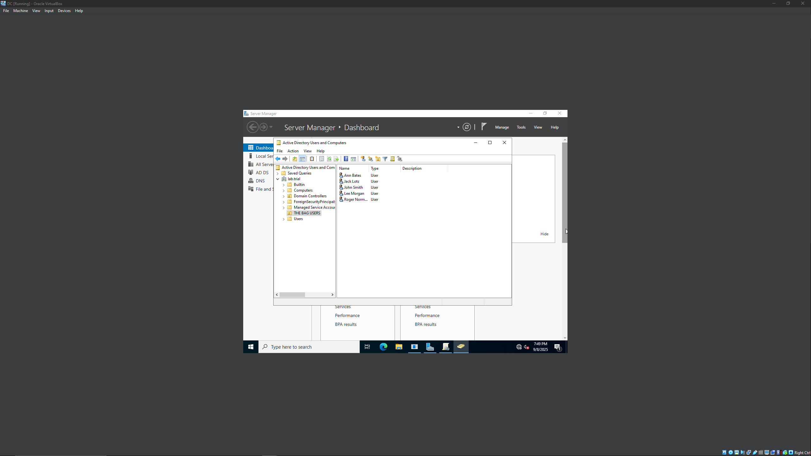
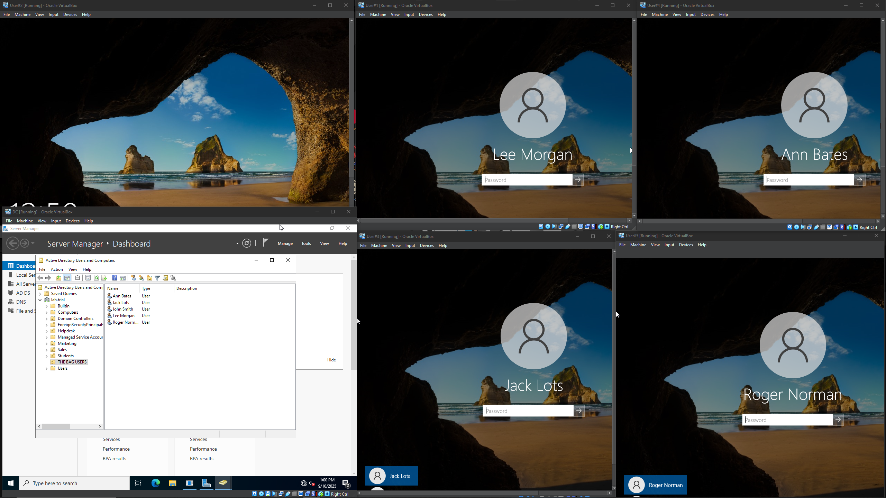
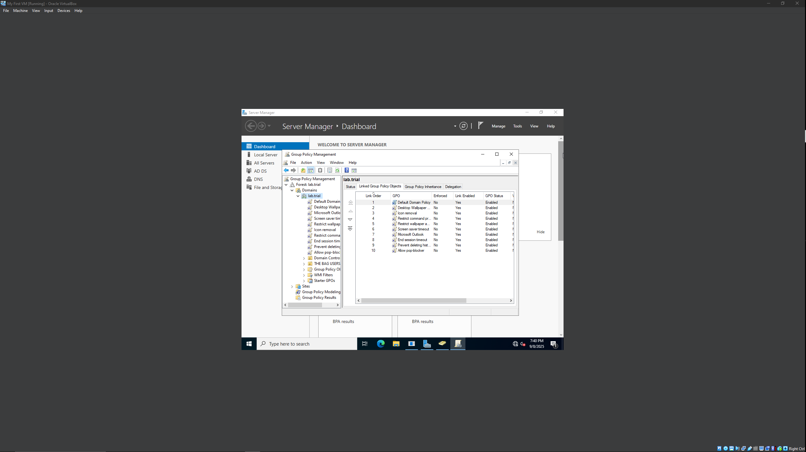

# ActiveDirectory-LAB

Title: Active Directory Lab: Multi-Client Domain Environment

## Overview

Designed and deployed a Windows Server 2022 Domain Controller in a Virtualbox environment, afterwards I configured Active Directory, DNS, and Group Policy, and joined multiple Windows 10 pro client machines to the domain. I created users, groups(OU), and applied GPOs to enforce security policies and manage access. I've included links to my IP addressing plan , GPO examples used for testing, and some issues I ran into , the reason for them, and how I got them fixed.

# Hardware Requirements

- Minimum : 2GB on DomainController & 2GB on Client VMs
- Recommended : 6GB on DomainController & 4GB on Domain VMs

# Architecture

- DC: Windows Server 2022 (Active Directory and DNS) (ISO)
- Clients: Windows 10 Pro (ISO)
- Network: Virtual Internal Network and NAT for internet

# Skills Utilized

- Active Directory
- DNS
- DHCP
- GPO
- Virtualization

# Objective For Project

- Understand the fundamental concepts of Active Directory and its role in network administration
- Develop skills in utilizing virtualization software (such as VMWare) to create and manage virtual machines
- Learn to set up and manage a Domain Controller within a network infrastructure
- Develop problem-solving skills through troubleshooting any issues encountered during the setup and configuration process
- Acquire proficiency in using PowerShell scripting to automate administrative tasks within a Windows environment
- Understand domain connectivity principles and authentication mechanisms, exemplified through logging into user accounts within a domain environment

## Steps Taken

- Installed Windows Server 2022 and promoted to Domain controller
- Installed Windows 10 Pro into multiple client VMs
- Configured DNS for domain lab.trial
- Created Organizational Units
- Added users and groups inside OUs
- Applied Group Policies (ex: enforcing password rules and restricting access to various settings)
- Joined multiple client VMs to the domain
- Verified policies and login authentication

(I've addressed the issues I came across in the link below)

## Documentation

- [IP Addressing Plan](Documentation/IP-Plan.md)
- [Group Policy Examples](Documentation/GPO-Examples.md)
- [Troubleshooting Notes](Documentation/Troubleshooting.md)

## Screenshots

Active Directory Users

Client Domain Login

GPO Examples

