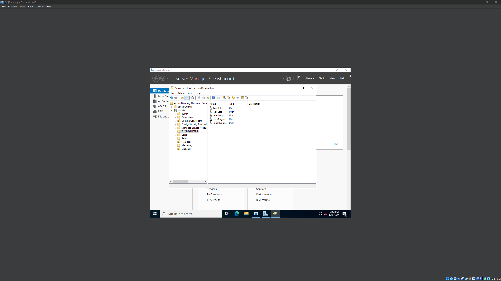

# ActiveDirectory-LAB

Title: Active Directory Lab: Multi-Client Domain Environment

Overview

Designed and deployed a Windows Server 2022 Domain Controller in a Virtualbox environment, afterwards I configured Active Directory, DNS, and Group Policy, and joined multiple Windows 10 pro client machines to the domain. I created users, groups(OU), and applied GPOs to enforce security policies and manage access.

Architecture

- DC: Windows Server 2022 (Active Directory and DNS) (ISO)
- Clients: Windows 10 Pro (ISO)
- Network: Virtual Internal Network and NAT for internet

Skills Utilized

- Active Directory
- DNS
- DHCP
- GPO
- Virtualization

Steps Taken

- Installed Windows Server 2022 and promoted to Domain controller
- Installed Windows 10 Pro into multiple client VMs
- Configured DNS for domain lab.trial
- Created Organizational Units
- Added users and groups inside OUs
- Applied Group Policies (ex: enforcing password rules and restricting access to various settings)
- Joined multiple client VMs to the domain
- Verified policies and login authentication

## Documentation

- [IP Addressing Plan](Documentation/IP-Plan.md)
- [Group Policy Examples](Documentation/GPO-Examples.md)
- [Troubleshooting Notes](Documentation/Troubleshooting.md)

## Screenshots

Active Directory Users

Client Domain Login

GPO Examples

